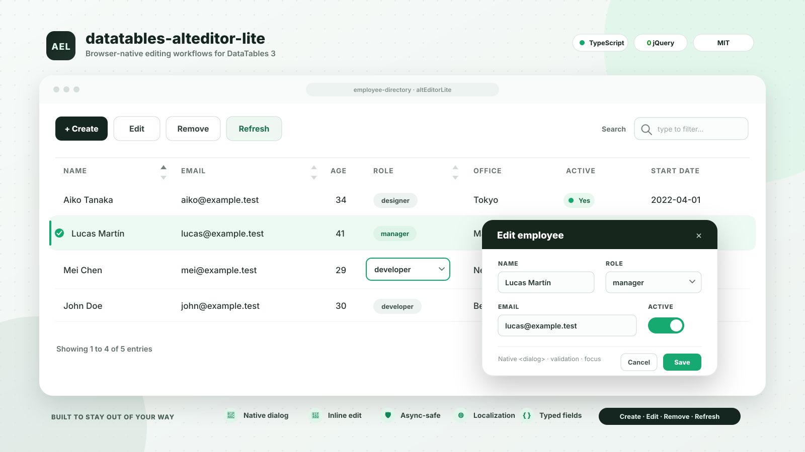

# datatables-alteditor-lite

[](https://github.com/bensitu/datatables-alteditor-lite)
[](https://www.npmjs.com/package/datatables-alteditor-lite)
[](https://www.jsdelivr.com/package/npm/datatables-alteditor-lite)

`datatables-alteditor-lite` is an independent, lightweight editing extension for
DataTables 3. It provides Create, Edit, Remove, and Refresh workflows using
TypeScript, native browser controls, and the public DataTables API. It has no
jQuery or UI-framework runtime dependency.

[Live demo](https://bensitu.github.io/datatables-alteditor-lite/examples/demo/) ·
[Getting started](docs/getting-started.md) · [Editing](docs/editing.md) ·
[Configuration](docs/configuration.md) · [Fields](docs/fields.md) ·
[Dynamic forms](docs/forms.md) ·
[Operations](docs/operations.md) · [API reference](docs/api-reference.md) ·
[Localization](docs/localization.md)

[](https://bensitu.github.io/datatables-alteditor-lite/examples/demo/)

## Highlights

- Native `<dialog>` forms with cloned custom layouts, focus containment,
  restoration, and accessible validation feedback
- Single-cell double-click or hover/touch editing with exact column mapping,
  explicit actions, validation, and optional KeyTable activation
- Dialog and Inline Edit can be enabled together on one editor
- Declarative dependent field state and shared cross-field validation
- Create, Edit, Remove, and Ajax-aware or local Refresh operations
- Non-optimistic asynchronous persistence with `AbortSignal`
- Stable Edit and Remove target snapshots that fail closed when row identity
  changes
- Text, email, password, number, date, time, datetime-local, textarea, checkbox,
  radio, select, local or remote SearchSelect, file, and hidden fields
- Typed option identity, safe nested field paths, custom validation, and optional
  local uniqueness checks
- Optional Buttons, Select, KeyTable, and ColReorder integration, plus
  post-commit ColumnControl and Responsive synchronization
- External JSON languages, inline overrides, and included English, Japanese,
  Simplified Chinese, and Spanish resources
- ESM and Browser Global distributions with responsive light and dark CSS

## Installation

### Npm

Install the core packages:

```bash
npm install datatables.net datatables-alteditor-lite
```

Install Buttons and Select when the registered editor buttons and selection-based
targeting are needed:

```bash
npm install datatables.net-buttons datatables.net-select
```

The package peer ranges accept compatible DataTables 3, Buttons 4, and Select 4
releases rather than one fixed patch version.

### CDN

For direct browser use, load DataTables first and include both AltEditorLite
distribution files:

```html
<link
  rel="stylesheet"
  href="https://cdn.jsdelivr.net/npm/datatables-alteditor-lite/dist/umd/alt-editor-lite.min.css"
/>
<script src="https://cdn.jsdelivr.net/npm/datatables-alteditor-lite/dist/umd/datatables-alteditor-lite.min.js"></script>
```

The unversioned URLs follow the latest published package. Pin the same package
version in both URLs for production, for example by inserting `@<version>` after
the package name. For externally hosted production assets, add independently
verified Subresource Integrity metadata and `crossorigin="anonymous"`, or
self-host the exact files. The script exposes
`globalThis.DataTablesAltEditorLite`; it does not bundle DataTables. Package
metadata declares the browser script and stylesheet separately so jsDelivr can
identify both default assets.

## Quick start

Import optional extensions before AltEditorLite so their integrations are
available during registration:

```ts
import DataTable from 'datatables.net';
import 'datatables.net-buttons';
import 'datatables.net-select';
import { AltEditorLite, type EditorValues } from 'datatables-alteditor-lite';
import 'datatables-alteditor-lite/style.css';

interface UserRow {
  readonly id: string;
  readonly name: string;
  readonly rank: number;
}

interface UserForm {
  readonly name: string;
  readonly rank: number;
}

const table = new DataTable<UserRow>('#users', {
  columns: [{ data: 'name' }, { data: 'rank' }],
  data: [],
  layout: {
    topStart: {
      buttons: [
        'altEditorLiteCreate',
        'altEditorLiteEdit',
        'altEditorLiteRemove',
        'altEditorLiteRefresh',
      ],
    },
  },
  rowId: 'id',
  select: { style: 'multi' },
});

const editor = new AltEditorLite<UserRow, UserForm>(table, {
  clientSide: {
    createRow(values: Readonly<EditorValues<UserForm>>): UserRow {
      return {
        id: crypto.randomUUID(),
        name: values.name ?? '',
        rank: values.rank ?? 1,
      };
    },
  },
  fields: [
    { label: 'Name', name: 'name', required: true, type: 'text' },
    {
      attributes: { min: '1' },
      label: 'Rank',
      name: 'rank',
      required: true,
      type: 'number',
    },
  ],
});
```

Create requires either `clientSide.createRow` or `operations.create`. Edit safely
merges declared fields by default, and Remove operates locally unless a persistence
callback is supplied.

Use explicit DataTables row selectors when Select is not installed:

```ts
await editor.openEditDialog('#user-42');
await editor.openRemoveDialog(['#user-42', '#user-43']);
```

The registered API method only retrieves an existing instance:

```ts
table.altEditorLite<UserForm>(); // AltEditorLite<UserRow, UserForm> | null
```

Call `editor.destroy()` before replacing the table or creating another editor for
the same table element.

## Editing

Dialog Edit is enabled by default. Inline Edit can be added independently, so a
single editor can provide complete Dialog forms and fast single-cell updates:

```ts
const editor = new AltEditorLite<UserRow, UserForm>(table, {
  editing: {
    dialog: { enabled: true },
    inline: {
      activation: 'doubleClick',
      columns: {
        actions: false,
        displayName: 'profile.name',
      },
      enabled: true,
    },
  },
  fields: [
    {
      inlineEdit: true,
      label: 'Name',
      name: 'profile.name',
      required: true,
      type: 'text',
    },
  ],
});

await editor.openInlineEdit('#user-42', 'displayName:name');
await editor.openEditDialog('#user-42');
```

Double-click activation uses compact Enter, Escape, Tab, and blur behavior.
Hover activation provides a discoverable pencil and explicit Submit / Cancel
actions; the default F2 shortcut can edit a KeyTable-focused cell. Setting
`keyboardActivation: false` disables only focused-cell activation, not keyboard
behavior inside an open session.

An active dialog prevents Inline activation. Create, Remove, Refresh, or Dialog
Edit safely cancel an active double-click session; an active hover session must
be resolved explicitly. Completed ColReorder operations rebuild mappings without
recreating the editor. All updates are non-optimistic and reuse one persistence
transaction. See [Editing](docs/editing.md) and [Lifecycle hooks](docs/hooks.md).

## Dynamic forms

Dialog forms can clone an application template and place fields into
`data-alteditor-lite-field` slots. Declarative dependencies can update options,
values, visibility, required, read-only, and disabled state with cancellation and
stale-result protection. A typed `validateForm` callback applies the same
cross-field data rules to Dialog Create, Dialog Edit, and Inline Edit.

Dependency value changes do not recursively run another resolver or fire the
target field's `onChange()`. See [Dynamic forms](docs/forms.md) for template
ownership, initial resolution, patch conflicts, validation order, and the Dialog
versus Inline boundary.

## Persistence operations

Remote callbacks receive the complete operation context and may be synchronous or
asynchronous. DataTables is changed only after a callback succeeds.

```ts
const editor = new AltEditorLite<UserRow, UserForm>(table, {
  fields,
  operations: {
    async create(values, context) {
      return await createUser(values, context.signal);
    },
    async update(values, original, context) {
      return await updateUser(original.id, values, context.signal);
    },
    async remove(rows, context) {
      await removeUsers(
        rows.map((row) => row.id),
        context.signal,
      );
    },
  },
});
```

Throw `AltEditorLiteError` for safe user-facing messages, field errors, and retry
behavior. Unknown exceptions are replaced with the localized generic error. See
[Operations](docs/operations.md) for cancellation and snapshot semantics.

## Localization

Included languages can be imported without registering source files manually:

```ts
import ja from 'datatables-alteditor-lite/locales/ja';

const editor = new AltEditorLite(table, { fields, language: ja });
```

Applications and CDN users can load their own partial JSON resource without
modifying or rebuilding the library:

```ts
import { loadEditorLanguage } from 'datatables-alteditor-lite';

const language = await loadEditorLanguage('/languages/fr-FR.json');
const editor = new AltEditorLite(table, { fields, language });
```

See [Localization](docs/localization.md) for the resource shape, placeholders, and
Browser Global registry.

## Browser Global usage

Include the AltEditorLite stylesheet, then load DataTables and optional extension
scripts before the AltEditorLite browser bundle:

```html
<link
  rel="stylesheet"
  href="https://cdn.jsdelivr.net/npm/datatables-alteditor-lite/dist/umd/alt-editor-lite.min.css"
/>
<script src="dataTables.js"></script>
<script src="dataTables.buttons.js"></script>
<script src="dataTables.select.js"></script>
<script src="https://cdn.jsdelivr.net/npm/datatables-alteditor-lite/dist/umd/datatables-alteditor-lite.min.js"></script>
```

The public API is available at `globalThis.DataTablesAltEditorLite`. Included
language registration bundles load after the main bundle; external JSON languages
use `DataTablesAltEditorLite.loadEditorLanguage(...)`.

See [Browser Global](docs/browser-global.md) for a complete CDN quick start, load
order, self-hosted paths, and language resources.

## Migrating from v0.3.1

v0.4.0 replaces mutually exclusive editing properties with composable
configuration. Move `editMode` and the top-level `inline` object under `editing`,
move `closeOnSuccess` to `editing.dialog.closeOnSuccess`, and rename field
`readonly` to `readOnly`. SearchSelect now uses `search.threshold`,
`search.debounceMs`, and a `remote` object containing `loadOptions` and
`resolveOption`. Compatibility aliases are not provided.

See the complete before-and-after examples in
[Configuration](docs/configuration.md#migrating-from-v031).

## Events

Listen directly on the owned table element. Events are observation-only, do not
bubble, and cannot cancel an operation.

```ts
table
  .table()
  .node()
  .addEventListener('alteditor-lite:success', (event) => {
    if (event instanceof CustomEvent) {
      console.log(event.detail.operation);
    }
  });
```

Create, Edit, and Remove follow `open → submit → success | error → close` when the
dialog closes. Refresh publishes start and complete phases. See
[Events](docs/events.md) for detail types and ordering.

## Demo

The [live demo](https://bensitu.github.io/datatables-alteditor-lite/examples/demo/)
uses the Browser Global distribution, the official DataTables CDN, an Ajax JSON
data source, asynchronous persistence, and external languages. Its employee
directory combines Dialog and Inline Edit, a grouped custom layout, dependent
choice fields, and cross-field date validation. Additional tables demonstrate
hover/touch interaction, remote SearchSelect, rendered controls, and extension
integration.

See [SECURITY.md](SECURITY.md) for private vulnerability reporting.

## Project status and attribution

The public API follows semantic versioning. This project is independent and is
not affiliated with or endorsed by the DataTables publisher. DataTables and its
extensions remain separate dependencies distributed under their own terms.

## Buy Me A Coffee

<a href="https://www.buymeacoffee.com/bensitu">
    
</a>

## License

[MIT](LICENSE) © Ben Situ.
