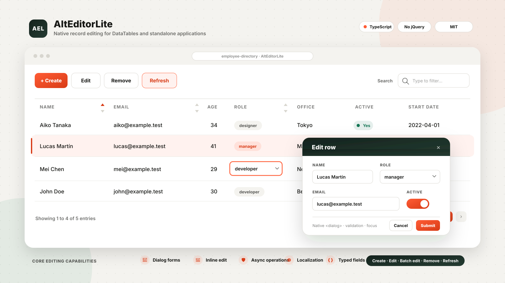

# AltEditorLite

[](https://github.com/bensitu/datatables-alteditor-lite)
[](https://www.npmjs.com/package/datatables-alteditor-lite)
[](https://www.jsdelivr.com/package/npm/datatables-alteditor-lite)

AltEditorLite is an independent, lightweight record editor published as
`datatables-alteditor-lite`. It provides neutral, DataTables 3, and standalone
Host APIs for Create, Edit, Remove, and Refresh workflows using TypeScript and
native browser controls. It has no jQuery or UI-framework runtime dependency.

[Live demo](https://bensitu.github.io/datatables-alteditor-lite/examples/demo/) ·
[Getting started](docs/getting-started.md) · [Standalone](docs/standalone.md) ·
[Editing](docs/editing.md) ·
[Configuration](docs/configuration.md) · [Fields](docs/fields.md) ·
[Dynamic forms](docs/forms.md) ·
[Operations](docs/operations.md) · [API reference](docs/api-reference.md) ·
[Localization](docs/localization.md)

[](https://bensitu.github.io/datatables-alteditor-lite/examples/demo/)

## Highlights

- Native `<dialog>` forms with cloned custom layouts, focus containment,
  restoration, and accessible validation feedback
- Dirty-aware asynchronous close decisions, Create initial values, and optional
  field validation when focus leaves a control
- Single-cell double-click or hover/touch editing with exact column mapping,
  explicit actions, validation, and optional KeyTable activation
- Dialog and Inline Edit can be enabled together on one editor
- Multi-record Dialog Edit with common-value overrides and individual-value restore
- Typed consumer-defined fields with Dialog support and explicit multi-record
  and Inline capabilities
- Declarative dependent field state and shared cross-field validation
- Create, Edit, Remove, and Ajax-aware or local Refresh operations
- Non-optimistic asynchronous persistence and asynchronous Host reads with
  `AbortSignal`
- Stable Edit and Remove target snapshots that fail closed when row identity
  changes
- Text, email, password, number, date, time, datetime-local, textarea, checkbox,
  radio, select, local or remote SearchSelect, file, hidden, and custom fields
- Typed option identity, safe nested field paths, custom validation, and optional
  local uniqueness checks
- Optional Buttons, Select, KeyTable, and ColReorder integration, plus
  post-commit ColumnControl and Responsive synchronization
- External JSON languages, inline overrides, and included English, Japanese,
  Simplified Chinese, and Spanish resources
- ESM and Browser Global distributions with responsive light and dark CSS
- A host-neutral root API, an explicit DataTables integration, and a standalone
  callback-backed host

## Installation

### Npm

Install the editor without a table runtime for neutral or standalone use:

```bash
npm install datatables-alteditor-lite
```

Install DataTables when using the DataTables integration:

```bash
npm install datatables.net datatables-alteditor-lite
```

Install Buttons and Select when the registered editor buttons and selection-based
targeting are needed:

```bash
npm install datatables.net-buttons datatables.net-select
```

`datatables.net` is an optional peer at package level, so neutral and standalone
consumers are not forced to install it. Importing the `/datatables` entry requires
a compatible DataTables 3 installation. Buttons 4 and Select 4 remain optional.

### CDN

For direct browser use, load DataTables first and include both AltEditorLite
distribution files:

<!-- prettier-ignore -->
```html
<link rel="stylesheet" href="https://cdn.jsdelivr.net/npm/datatables-alteditor-lite/dist/umd/alt-editor-lite.min.css" />
<script src="https://cdn.jsdelivr.net/npm/datatables-alteditor-lite/dist/umd/alt-editor-lite.min.js"></script>
```

The unversioned URLs follow the latest published package. Pin the same package
version in both URLs for production, for example by inserting `@<version>` after
the package name. For externally hosted production assets, add independently
verified Subresource Integrity metadata and `crossorigin="anonymous"`, or
self-host the exact files. The script exposes
`globalThis.AltEditorLite`; it does not bundle DataTables. Package
metadata declares the browser script and stylesheet separately so jsDelivr can
identify both default assets.

## Quick start

Import optional extensions before AltEditorLite so their integrations are
available during registration:

```ts
import DataTable from 'datatables.net';
import 'datatables.net-buttons';
import 'datatables.net-select';
import { AltEditorLite, type EditorValues } from 'datatables-alteditor-lite/datatables';
import 'datatables-alteditor-lite/style.css';

interface UserRow {
  readonly id: string;
  readonly name: string;
  readonly rank: number;
}

interface UserForm {
  readonly name: string;
  readonly rank: number;
}

const table = new DataTable<UserRow>('#users', {
  columns: [{ data: 'name' }, { data: 'rank' }],
  data: [],
  layout: {
    topStart: {
      buttons: [
        'altEditorLiteCreate',
        'altEditorLiteEdit',
        'altEditorLiteRemove',
        'altEditorLiteRefresh',
      ],
    },
  },
  rowId: 'id',
  select: { style: 'multi' },
});

const editor = new AltEditorLite<UserRow, UserForm>(table, {
  clientSide: {
    createRow(values: Readonly<EditorValues<UserForm>>): UserRow {
      return {
        id: crypto.randomUUID(),
        name: values.name ?? '',
        rank: values.rank ?? 1,
      };
    },
  },
  fields: [
    { label: 'Name', name: 'name', required: true, type: 'text' },
    {
      attributes: { min: '1' },
      label: 'Rank',
      name: 'rank',
      required: true,
      type: 'number',
    },
  ],
});
```

Create requires either `clientSide.createRow` or `operations.create`. Edit safely
merges declared fields by default, and Remove operates locally unless a persistence
callback is supplied.

Each line below is an independent action to connect to an application control.
Explicit DataTables row selectors do not require Select:

```ts
await editor.openCreateDialog({ name: 'New user', rank: 1 });
await editor.openEditDialog('#user-42');
await editor.openBatchEditDialog(['#user-42', '#user-43']);
await editor.openRemoveDialog(['#user-42', '#user-43']);
await editor.refresh();
```

The registered API method only retrieves an existing instance:

```ts
table.altEditorLite<UserForm>(); // AltEditorLite<UserRow, UserForm> | null
```

Call `editor.destroy()` before replacing the table or creating another editor for
the same table element.

The `/datatables` entry registers the retrieval API and optional Buttons
integration. The neutral root entry has no DataTables import or registration side
effect. For integration-specific application work, keep the host exposed by the
facade and unwrap it explicitly:

```ts
const dataTablesApi = editor.dataTablesHost.unwrap();
```

Code using `unwrap()` is intentionally DataTables-specific.

## Standalone usage

Use `/standalone` when the application owns record storage and does not use a
table or grid runtime:

```ts
import { AltEditorLite, StandaloneHost } from 'datatables-alteditor-lite/standalone';

const records = new Map<string, UserRow>();
const host = new StandaloneHost<UserRow, string>({
  read: (key) => {
    const row = records.get(key);
    if (row === undefined) throw new Error('Record unavailable.');
    return row;
  },
  applyCreate: (row) => {
    records.set(row.id, row);
    return row.id;
  },
  applyUpdate: (key, row) => {
    records.set(key, row);
    return key;
  },
  applyUpdates: (updates) => {
    updates.forEach(({ target, row }) => records.set(target, row));
  },
  applyRemove: (keys) => keys.forEach((key) => records.delete(key)),
  records: () => [...records].map(([target, row]) => ({ row, target })),
});

const editor = new AltEditorLite<UserRow, UserForm, string>(host, {
  fields,
});
```

The `records` provider is optional unless a configured field uses local
uniqueness validation. An optional `refresh` callback defines consumer-owned
refresh work; without it, refresh completes without changing records. Events are
dispatched on `host.eventTarget`, which can be supplied by the application or
left as the host's private `EventTarget`.

See [Standalone usage](docs/standalone.md) for record callback semantics,
refresh, event ownership, cleanup, and a complete in-memory example.

## Editing

Dialog Edit is enabled by default. Inline Edit can be added independently, so a
single editor can provide complete Dialog forms and fast single-cell updates:

```ts
const editor = new AltEditorLite<UserRow, UserForm>(table, {
  editing: {
    dialog: { enabled: true },
    inline: {
      activation: 'doubleClick',
      columns: {
        actions: false,
        displayName: 'profile.name',
      },
      enabled: true,
    },
  },
  fields: [
    {
      inlineEdit: true,
      label: 'Name',
      name: 'profile.name',
      required: true,
      type: 'text',
    },
  ],
});

await editor.openInlineEdit('#user-42', 'displayName:name');
await editor.openEditDialog('#user-42');
await editor.openBatchEditDialog(['#user-42', '#user-43']);
```

Multi-record editing shows common values directly and marks differing values as
multiple values. A differing field is unchanged until the user assigns a common
value; restoring it removes that field from the submitted changes. Unique and
file fields remain visible but cannot receive a shared value. The registered
DataTables Edit button opens single-row editing for one selected row and
multi-record editing for two or more selected rows when that capability is
available.

Double-click activation uses compact Enter, Escape, Tab, and blur behavior.
Hover activation provides a discoverable pencil, explicit Submit / Cancel
actions, and Escape cancellation. KeyTable-focused cells use F2 by default and
can accept several exact shortcuts, including Enter or Space. Setting
`keyboardActivation: false` disables only focused-cell activation, not keyboard
behavior inside an open session.

An active dialog prevents Inline activation. Create, Remove, Refresh, or Dialog
Edit safely cancel an active double-click session; an active hover session must
be resolved explicitly. Completed ColReorder operations rebuild mappings without
recreating the editor. All updates are non-optimistic and reuse one persistence
transaction. See [Editing](docs/editing.md) and [Lifecycle hooks](docs/hooks.md).

## Dynamic forms

Dialog forms can clone an application template and place fields into
`data-alteditor-lite-field` slots. A synchronous template resolver can select a
different layout for Create, Edit, or multi-record Edit. Declarative dependencies
can update options, values, visibility, required, read-only, and disabled state
with cancellation and stale-result protection. A field may use `validateOn:
'blur'` for early feedback; submission still reruns the authoritative complete
client-side validation sequence. A typed `validateForm` callback applies the
same cross-field data rules to Dialog Create, Dialog Edit, multi-record Dialog
Edit, and Inline Edit. Multi-record dependencies use only known common values and
explicit overrides; preserved differing values are omitted.

Dependency value changes do not recursively run another resolver or fire the
target field's `onChange()`. See [Dynamic forms](docs/forms.md) for template
ownership, initial resolution, patch conflicts, validation order, and the Dialog
versus Inline boundary.

## Persistence operations

Remote callbacks receive the complete operation context and may be synchronous or
asynchronous. The Host applies Create, Edit, and Remove results only after the
corresponding persistence callback succeeds.

```ts
const editor = new AltEditorLite<UserRow, UserForm>(table, {
  fields,
  operations: {
    async create(values, context) {
      return await createUser(values, context.signal);
    },
    async update(values, original, context) {
      return await updateUser(original.id, values, context.signal);
    },
    async updateMany(changes, originals, context) {
      return await updateUsers(originals, changes, context.signal);
    },
    async remove(rows, context) {
      await removeUsers(
        rows.map((row) => row.id),
        context.signal,
      );
    },
  },
});
```

Throw `AltEditorLiteError` for safe user-facing messages, backend field errors,
and retry behavior. Known `fieldErrors` are mapped back to active controls while
the canonical Host record remains unchanged; retryable failures keep submission
available. Unknown exceptions are replaced with the localized generic error. See
[Operations](docs/operations.md) for cancellation, server validation, and
snapshot semantics.

## Localization

Included languages can be imported without registering source files manually:

```ts
import ja from 'datatables-alteditor-lite/locales/ja';

const editor = new AltEditorLite(table, { fields, language: ja });
```

Applications and CDN users can load their own partial JSON resource without
modifying or rebuilding the library:

```ts
import { loadEditorLanguage } from 'datatables-alteditor-lite';

const language = await loadEditorLanguage('/languages/fr-FR.json');
const editor = new AltEditorLite(table, { fields, language });
```

See [Localization](docs/localization.md) for the resource shape, placeholders, and
Browser Global registry.

## Browser Global usage

Include the AltEditorLite stylesheet, then load DataTables and optional extension
scripts before the AltEditorLite browser bundle:

<!-- prettier-ignore -->
```html
<link rel="stylesheet" href="https://cdn.jsdelivr.net/npm/datatables-alteditor-lite/dist/umd/alt-editor-lite.min.css" />
<script src="https://cdn.datatables.net/3.0.2/js/dataTables.min.js"></script>
<script src="https://cdn.datatables.net/buttons/4.0.2/js/dataTables.buttons.min.js"></script>
<script src="https://cdn.datatables.net/select/4.0.1/js/dataTables.select.min.js"></script>
<script src="https://cdn.jsdelivr.net/npm/datatables-alteditor-lite/dist/umd/alt-editor-lite.min.js"></script>
```

The neutral editor, DataTables adapters, and `StandaloneHost` are available at
`globalThis.AltEditorLite`. The main browser bundle requires DataTables
to load first. Use `AltEditorLite.Editor` for the DataTables constructor and
`AltEditorLite.AltEditorLite` for the neutral constructor. A separate
`alt-editor-lite-standalone.js` and `alt-editor-lite-standalone.min.js` bundles
expose the neutral editor and `StandaloneHost` through
`globalThis.AltEditorLiteStandalone` without requiring DataTables.
Included language registration bundles load after the main DataTables bundle;
external JSON languages use
`AltEditorLite.loadEditorLanguage(...)`.

See [Browser Global](docs/browser-global.md) for a complete CDN quick start, load
order, self-hosted paths, and language resources.

## Events

Listen directly on the host event target. DataTables uses the owned table element;
Standalone uses the configured or host-created `EventTarget`. Events are
observation-only, do not bubble, and cannot cancel an operation.

```ts
table
  .table()
  .node()
  .addEventListener('alteditor-lite:success', (event) => {
    if (event instanceof CustomEvent) {
      console.log(event.detail.operation);
    }
  });
```

Create, Edit, multi-record Edit, and Remove follow
`open → submit → success | error → close` when the dialog closes. Refresh
publishes start and complete notifications. See
[Events](docs/events.md) for detail types and ordering.

## Demo

The [live demo](https://bensitu.github.io/datatables-alteditor-lite/examples/demo/)
uses the Browser Global distribution, the official DataTables CDN, an Ajax JSON
data source, asynchronous persistence, and external languages. Its employee
directory combines single- and multi-record Dialog Edit, Inline Edit, a grouped
custom layout, dependent choice fields, and cross-field date validation.
Additional examples demonstrate
hover/touch interaction, remote SearchSelect, extension integration, and
consumer-owned records without a table or grid.

See [SECURITY.md](SECURITY.md) for private vulnerability reporting.

## Development

Run `npm run check` for the complete local verification suite. The compressed
distribution check runs after the build and compares the main JavaScript,
Standalone JavaScript, and shared CSS outputs with the documented limits in
`scripts/check-bundle-size.mjs`. To run it separately, use
`npm run build && npm run check:size`.

## Project status and attribution

The public API follows semantic versioning. This project is independent and is
not affiliated with or endorsed by the DataTables publisher. DataTables and its
extensions remain separate dependencies distributed under their own terms.

## Buy Me A Coffee

<a href="https://www.buymeacoffee.com/bensitu">
    
</a>

## License

[MIT](LICENSE) © Ben Situ.
